  
  
  
  

I am 22 and based in Tokyo. I run the engineering side of a company that books photo shoots for people visiting Japan, so most of what I build is the unglamorous part — booking, payments, operations, and the agents that keep those running when nobody is watching.

I studied Computer Science in Seattle and I work in Japanese and English.

 

### Stack

<table>
<tr>
<td width="140"><b>Languages</b></td>
<td></td>
</tr>
<tr>
<td><b>Frontend</b></td>
<td></td>
</tr>
<tr>
<td><b>Backend &amp; data</b></td>
<td></td>
</tr>
<tr>
<td><b>Infrastructure</b></td>
<td></td>
</tr>
</table>

Also: Anthropic API · MCP · Stripe · GA4 · Search Console

 

### Activity

 

  

Both cards are generated from the GitHub API by a workflow in this repository. The layouts follow <a href="https://github.com/Ashutosh00710/github-readme-activity-graph">github-readme-activity-graph</a> and <a href="https://github.com/stats-organization/github-stats-extended">github-stats-extended</a>, which are hosted on instances that now return 402 and 503.
