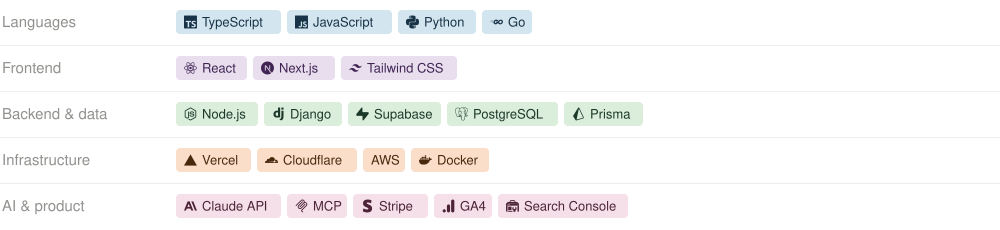
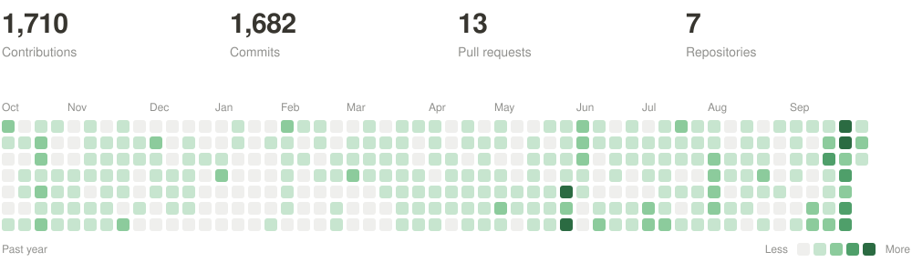

<picture>
  <source media="(prefers-color-scheme: dark)" srcset="./assets/header-dark.svg" />
  
</picture>

 

I am 22 and based in Tokyo. I run the engineering side of a company that books photo shoots for people visiting Japan, so most of what I build is the unglamorous part — booking, payments, operations, and the agents that keep those running when nobody is watching.

I studied Computer Science in Seattle and I work in Japanese and English.

&nbsp; [shogo.build](https://shogo.build) &emsp;
&nbsp; [X](https://x.com/copilot_shogo) &emsp;
&nbsp; [LinkedIn](https://linkedin.com/in/shogo-kikuchi-19b792321) &emsp;
&nbsp; [Email](mailto:shogo.initeng0306@gmail.com)

 

### Stack

<picture>
  <source media="(prefers-color-scheme: dark)" srcset="./assets/stack-dark.svg" />
  
</picture>

 

### Activity

<picture>
  <source media="(prefers-color-scheme: dark)" srcset="./assets/activity-dark.svg" />
  
</picture>
